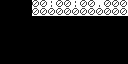
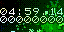

# VideoTickerGenerator

Генератор видяшек для извращений с видеоредакторами, кодеками, контейнерами или плеерами. Когда-то давно я делал такие штуки в AE, было очень красиво, но я все потерял.

Теперь есть такой вот генератор:

-Генератор звука почему-то создает непонятные вибрации по амплитуде, не разобрался почему. Кто-нибудь может починить?- Это виноват кривой енкодер от ффмпега

Добавил цветной режим:

Использованы шрифты от Спектрума, https://damieng.com/typography/zx-origins/
